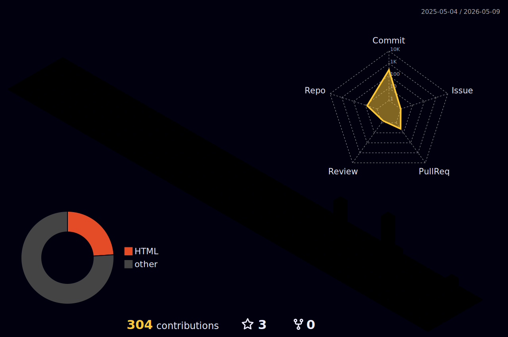

 

  <strong>
    Information Security | Cybersecurity Analyst | Penetration Tester | Capture The Flag Player
  </strong>

   

I specialize in **Ethical Hacking**, **Malware Analysis**, **Vulnerability Assessment**, **Penetration Testing**, and **Information Security**.  
Operating across **technical security operations**, **infrastructure protection**, **server and cloud security**, and **governance-driven information security practices**.

- 🔐 Perform vulnerability assessments and penetration testing (web, mobile, infrastructure)
- 🐞 Conduct malware analysis, exploitation, debugging, and remediation
- 🐧 Strong background in Linux systems, server hardening, and privilege escalation
- ☁️ Deploy and secure web servers and cloud environments (AWS)
- 📜 Develop and maintain security policies, procedures, and governance frameworks
- 🖥️ Monitor and analyze security events using SIEM tools
- 🛡️ Manage and evaluate endpoint protection solutions
- 👥 Audit Active Directory and enforce access control best practices
- 🧠 Deliver cybersecurity training, seminars, and technical demos
<!-- Honor -->

<!-- berk quote -->

<!-- drop down -->

> 薪王
>> 初始之火
>>> 狂战士铠甲
>>>> 交界地
>>>>> 蚀之仪式

<!-- languages and coding tools -->

 
 
<strong><h2> 🕯️ Runes & Relics 🕯️ </h2></strong>

<!-- 👨‍💻 Programming & Markup Languages -->
<h3 align="center">👨‍💻 Programming & Markup Languages</h3>
<table align="center" width="90%" cellspacing="0" cellpadding="14" style="border-collapse: collapse;">
<tr>
<td align="center" width="20%" style="border: 1px solid #30363d;">

</td>
<td align="center" width="20%" style="border: 1px solid #30363d;">

</td>
<td align="center" width="20%" style="border: 1px solid #30363d;">

</td>
<td align="center" width="20%" style="border: 1px solid #30363d;">

</td>
<td align="center" width="20%" style="border: 1px solid #30363d;">

</td>
</tr>

<tr>
<td align="center" style="border: 1px solid #30363d;">

</td>
<td align="center" style="border: 1px solid #30363d;">

</td>
<td align="center" style="border: 1px solid #30363d;">

</td>
<td align="center" style="border: 1px solid #30363d;">

</td>
<td align="center" style="border: 1px solid #30363d;">

</td>
</tr>
</table>

 

<!-- 🗄️ Databases & Cloud -->
<h3 align="center">🗄️ Databases & Cloud</h3>
<table align="center" width="75%" cellspacing="0" cellpadding="14" style="border-collapse: collapse;">
<tr>
<td align="center" width="33%" style="border: 1px solid #30363d;">

</td>
<td align="center" width="33%" style="border: 1px solid #30363d;">

</td>
<td align="center" width="33%" style="border: 1px solid #30363d;">

</td>
</tr>
</table>

 

<!-- ⚛️ Frameworks & Libraries -->
<h3 align="center">⚛️ Frameworks & Libraries</h3>
<table align="center" width="60%" cellspacing="0" cellpadding="14" style="border-collapse: collapse;">
<tr>
<td align="center" width="50%" style="border: 1px solid #30363d;">

</td>
<td align="center" width="50%" style="border: 1px solid #30363d;">

</td>
</tr>
</table>

 

<!-- 🛠️ DevOps & Tools -->
<h3 align="center">🛠️ DevOps & Tools</h3>
<table align="center" width="90%" cellspacing="0" cellpadding="14" style="border-collapse: collapse;">
<tr>
<td align="center" width="16.6%" style="border: 1px solid #30363d;">

</td>
<td align="center" width="16.6%" style="border: 1px solid #30363d;">

</td>
<td align="center" width="16.6%" style="border: 1px solid #30363d;">

</td>
<td align="center" width="16.6%" style="border: 1px solid #30363d;">

</td>
<td align="center" width="16.6%" style="border: 1px solid #30363d;">

</td>
<td align="center" width="16.6%" style="border: 1px solid #30363d;">

</td>
</tr>

<tr>
<td align="center" style="border: 1px solid #30363d;">

</td>
<td align="center" style="border: 1px solid #30363d;">

</td>
<td style="border: 1px solid #30363d;"></td>
<td style="border: 1px solid #30363d;"></td>
<td style="border: 1px solid #30363d;"></td>
<td style="border: 1px solid #30363d;"></td>
</tr>
</table>

 
 
<strong><h2> ⚔️ Armaments of Conquest 🩸 </h2></strong>

⸸ Instruments of War. ⸸

👁️ Click me to Unveil What Lies Within 👁️

### 🌐 Network Scanning & Enumeration

### 🔍 Vulnerability Scanners

### 🌍 Web Application Testing

## 🔴 Red Team Tools

### 🔑 Credential & Password Attacks

### 🧠 Exploitation & Post-Exploitation

## 🪟 Windows Payloads & Privilege Escalation

## 🧪 Command & Control (C2) Frameworks (Automated Exploitation mostly)

## 🔬 Reverse Engineering & Debugging

## 🔵 Blue Team / Defensive Tools

### 📡 Monitoring & Traffic Analysis

### 📊 SIEM & Log Monitoring

### 🛡️ Endpoint Protection (EDR/XDR)

### 🛡️ Defensive Scanning & Validation

### 🧩 Digital Forensics & Incident Response

## 🧰 OSINT & Reconnaissance

## 🎯 CTF & Binary Exploitation

## 🤖 AI-Assisted Development

 
 

 
 
<strong><h2> 📜 Records of Struggle 🗡 </h2></strong>

𒉭 Brand of the Ashen one. 𒉭

 

<!-- Streak Stats -->

 

<!-- Activity Graph -->

<!-- 3d -->

<!-- Activity Graph -->

Some of my credly certs

 

 

 
 

 
 
<strong><h2> 🔥 Ashen Fields 🐺 </h2></strong>

 ঔঌ Where every contribution rekindles the First Flame. ৡ 

<!-- farm -->

 
 

 
 
<strong><h2> 👑 Insignia of the Scarlet Bloom 🌸 </h2></strong>

˚.*ੈ✩‧₊˚ Blessings from the Goddess of Rot. ⋆.˚ ☾⭒.˚

 

 

 
 

 
 
<strong><h2> 🔥 Firelink Shrine 🌘 </h2></strong>

 ﴾ Rest here, traveler — find me beyond the flame. ﴿ 
‏

<!-- socials -->

